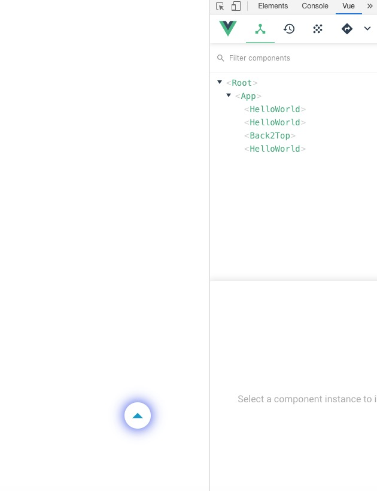

# vue-back2top


### how to use
```javascript

step 1.

npm install --save-D k-vue-back2top

step 2.

import Back2Top from 'k-vue-back2top'

step 3.

components: {
	Back2top
}

step 4.

<Back2top/>

```


### example
[](https://github.com/tianjianen/vue-back2top)

